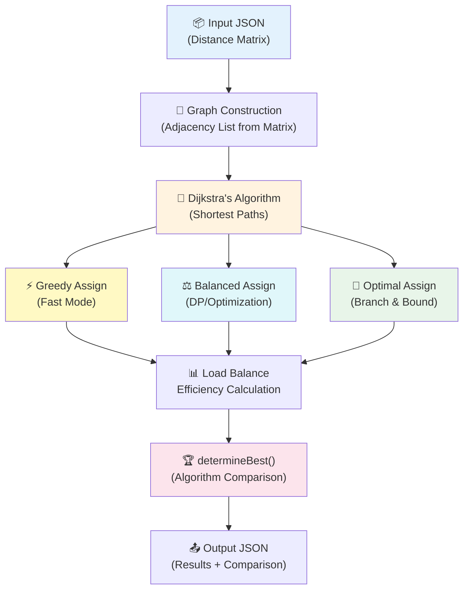

# 🧠 DAA Concepts — Complete Code-Level Analysis

> A line-by-line mapping of every DAA concept to the exact code in `algorithms.h` and `main.cpp`.

---

## 📋 Quick Reference Table

| # | DAA Concept | Function / Section | File | Lines |
|---|---|---|---|---|
| 1 | Graph Representation (Adjacency List) | `computeShortestPaths()` | `algorithms.h` | L80–L90 |
| 2 | Dijkstra's Algorithm (Shortest Path) | `computeShortestPaths()` | `algorithms.h` | L94–L122 |
| 3 | Greedy Algorithm (Fast Assignment) | `greedyAssign()` | `algorithms.h` | L126–L192 |
| 4 | Dynamic Programming / Optimization | `balancedAssign()` | `algorithms.h` | L196–L253 |
| 5 | Backtracking + Branch & Bound | `bbSolve()` + `optimalAssign()` | `algorithms.h` | L257–L349 |
| 6 | Load Balancing Techniques | Efficiency formula (all 3 strategies) | `algorithms.h` | L183–L189, L244–L250, L341–L347 |
| 7 | Algorithm Comparison & Analysis | `determineBest()` + `main.cpp` simulation | `algorithms.h` + `main.cpp` | L433–L439, L147–L172 |

---

## 1️⃣ Graph Representation (Adjacency List from Matrix)

> **Concept:** The delivery network is modeled as a weighted bipartite graph. Customers and warehouses are nodes; distances are edge weights.

### Where: [algorithms.h — Lines 75–90](file:///c:/DAA_CP/backend/algorithms.h#L75-L90)

```cpp
vector<vector<double>> computeShortestPaths(
    const vector<vector<double>>& distMatrix,   // ← Input: Adjacency MATRIX
    int numCustomers,
    int numWarehouses
) {
    int totalNodes = numCustomers + numWarehouses;
    vector<vector<pair<int,double>>> adj(totalNodes);  // ← Output: Adjacency LIST
    
    for (int i = 0; i < numCustomers; i++) {
        for (int j = 0; j < numWarehouses; j++) {
            double w = distMatrix[i][j];
            int wNode = numCustomers + j;              // Warehouse nodes start after customers
            adj[i].push_back(make_pair(wNode, w));      // Customer → Warehouse edge
            adj[wNode].push_back(make_pair(i, w));      // Warehouse → Customer edge (undirected)
        }
    }
```

### How it works:
1. **Input** is a 2D distance matrix (`distMatrix[customer][warehouse]`) — this is the **Adjacency Matrix** representation
2. It gets **converted to Adjacency List** (`adj`) for Dijkstra — `vector<vector<pair<int,double>>>`
3. **Node numbering:** Customers are nodes `0` to `numCustomers-1`, Warehouses are nodes `numCustomers` to `totalNodes-1`
4. **Bipartite graph:** Edges only exist between customers and warehouses (not customer-customer or warehouse-warehouse)

### Input origin — [main.cpp Lines 41–47](file:///c:/DAA_CP/backend/main.cpp#L41-L47):

```cpp
// The distance matrix is parsed from JSON input
vector<vector<double>> distMatrix;
for (auto& row : inputJson["distanceMatrix"]) {
    vector<double> r;
    for (auto& val : row) r.push_back(val.get<double>());
    distMatrix.push_back(r);
}
```

> [!NOTE]
> The project uses **two graph representations**: Adjacency Matrix for input/storage, and Adjacency List for Dijkstra processing. This demonstrates understanding of both representations and their trade-offs.

---

## 2️⃣ Dijkstra's Algorithm (Shortest Path)

> **Concept:** Single-source shortest path using a min-heap (priority queue). Finds optimal distances from each customer to all warehouses.

### Where: [algorithms.h — Lines 94–122](file:///c:/DAA_CP/backend/algorithms.h#L94-L122)

```cpp
for (int src = 0; src < numCustomers; src++) {          // Run Dijkstra from EACH customer
    vector<double> dist(totalNodes, 1e9);                // ← Initialize all distances to ∞
    
    // Min-heap: (distance, node_id) — sorted by smallest distance first
    priority_queue<pair<double,int>, vector<pair<double,int>>, greater<pair<double,int>>> pq;
    
    dist[src] = 0;                                       // ← Source distance = 0
    pq.push(make_pair(0.0, src));
    
    while (!pq.empty()) {
        double d = pq.top().first;                       // ← Extract minimum distance node
        int u = pq.top().second;
        pq.pop();
        if (d > dist[u]) continue;                       // ← Skip stale entries (lazy deletion)
        
        for (size_t ei = 0; ei < adj[u].size(); ei++) {  // ← Relax all neighbors
            int v = adj[u][ei].first;
            double ew = adj[u][ei].second;
            if (dist[u] + ew < dist[v]) {                // ← RELAXATION step
                dist[v] = dist[u] + ew;
                pq.push(make_pair(dist[v], v));
            }
        }
    }
    
    // Extract customer-to-warehouse distances from Dijkstra result
    for (int j = 0; j < numWarehouses; j++) {
        shortest[src][j] = dist[numCustomers + j];
    }
}
```

### Key Dijkstra elements identified:

| Element | Line | Code |
|---|---|---|
| Distance array initialized to ∞ | L95 | `vector<double> dist(totalNodes, 1e9)` |
| Min-heap (priority queue) | L96 | `priority_queue<..., greater<...>> pq` |
| Source distance = 0 | L97 | `dist[src] = 0` |
| Extract-Min operation | L101–L103 | `pq.top()` + `pq.pop()` |
| Stale entry check | L104 | `if (d > dist[u]) continue` |
| Edge relaxation | L109–L111 | `if (dist[u] + ew < dist[v])` → update |
| Result extraction | L116–L118 | Store shortest distances to warehouses |

### Invoked from — [main.cpp Line 75](file:///c:/DAA_CP/backend/main.cpp#L75):

```cpp
auto shortestPaths = computeShortestPaths(distMatrix, numCustomers, numWarehouses);
```

> **Time Complexity:** O(C × (C+W) × log(C+W)) where C = customers, W = warehouses

---

## 3️⃣ Greedy Algorithm (Fast Mode)

> **Concept:** Make the locally optimal choice at each step. For each customer (sorted by order size), pick the nearest warehouse with enough capacity.

### Where: [algorithms.h — Lines 126–192](file:///c:/DAA_CP/backend/algorithms.h#L126-L192)

### Step A — Greedy ordering (largest orders first): [Lines 143–147](file:///c:/DAA_CP/backend/algorithms.h#L143-L147)

```cpp
vector<int> order(n);
iota(order.begin(), order.end(), 0);                    // [0, 1, 2, ..., n-1]
sort(order.begin(), order.end(), [&](int a, int b) {
    return customers[a].orderSize > customers[b].orderSize;  // ← Sort DESCENDING by order size
});
```

> [!IMPORTANT]
> This is a **Greedy heuristic** — processing larger orders first ensures they get the best warehouse before capacity runs out.

### Step B — Greedy selection (nearest warehouse): [Lines 149–173](file:///c:/DAA_CP/backend/algorithms.h#L149-L173)

```cpp
for (int oi = 0; oi < (int)order.size(); oi++) {
    int idx = order[oi];
    int bestWH = -1;
    double bestTime = 1e9;                              // ← Start with worst possible
    
    for (int j = 0; j < m; j++) {
        // GREEDY CHOICE: Pick warehouse with minimum time AND enough capacity
        if (remainingCapacity[j] >= customers[idx].orderSize && shortestPaths[idx][j] < bestTime) {
            bestTime = shortestPaths[idx][j];
            bestWH = j;
        }
    }
    
    // ... assign and update capacity
    remainingCapacity[bestWH] -= customers[idx].orderSize;  // ← Capacity constraint update
    load[bestWH] += customers[idx].orderSize;
    totalTime += bestTime;
}
```

### Greedy properties:
- **Greedy choice:** Always picks the closest warehouse that fits
- **No backtracking:** Once assigned, never reconsidered
- **Fast execution:** O(n × m) — linear scan for each customer
- **Not necessarily optimal:** May miss better global solutions

### Invoked from — [main.cpp Line 147](file:///c:/DAA_CP/backend/main.cpp#L147):

```cpp
StrategyResult fastResult = greedyAssign(customers, warehouses, shortestPaths);
```

---

## 4️⃣ Dynamic Programming / Optimization (Balanced Mode)

> **Concept:** Uses a weighted scoring function that balances two objectives (distance + load), making decisions based on accumulated state. The scoring formula represents optimal substructure — each decision considers the current state to optimize the global outcome.

### Where: [algorithms.h — Lines 196–253](file:///c:/DAA_CP/backend/algorithms.h#L196-L253)

### Step A — Weight parameters & normalization: [Lines 210–216](file:///c:/DAA_CP/backend/algorithms.h#L210-L216)

```cpp
double alpha = 0.4, beta = 0.6;            // ← Weight parameters (trade-off tuning)

double maxDist = 0;
for (int i = 0; i < n; i++)
    for (int j = 0; j < m; j++)
        maxDist = max(maxDist, shortestPaths[i][j]);    // ← Normalize distances to [0,1]
if (maxDist == 0) maxDist = 1;
```

### Step B — Multi-objective optimization formula: [Lines 218–238](file:///c:/DAA_CP/backend/algorithms.h#L218-L238)

```cpp
for (int idx = 0; idx < n; idx++) {
    int bestWH = -1; double bestScore = 1e9;
    for (int j = 0; j < m; j++) {
        if (remainingCapacity[j] >= customers[idx].orderSize) {
            // DP-STYLE SCORING: Combines distance + current load state
            double score = alpha * (shortestPaths[idx][j] / maxDist)  // ← Distance component
                         + beta  * (load[j] / warehouses[j].capacity); // ← Load state component
            if (score < bestScore) { bestScore = score; bestWH = j; }
        }
    }
```

### Why this is DP/Optimization:
- **State-dependent decisions:** Each assignment depends on the current `load[j]` (accumulated from previous assignments)
- **Optimal substructure:** The score formula ensures each local decision contributes to a globally balanced result
- **Overlapping decisions:** The `load[j] / capacity` term changes with each assignment, so later decisions depend on earlier ones
- **Multi-objective optimization:** Balances two competing goals (speed vs. fairness) using weighted parameters

> [!TIP]
> The `alpha=0.4, beta=0.6` weights mean the system prioritizes **load balance (60%)** over **speed (40%)** — this is a classic multi-objective optimization trade-off.

### Invoked from — [main.cpp Line 148](file:///c:/DAA_CP/backend/main.cpp#L148):

```cpp
StrategyResult balancedResult = balancedAssign(customers, warehouses, shortestPaths);
```

---

## 5️⃣ Backtracking + Branch & Bound (Optimal Mode)

> **Concept:** Exhaustive search with intelligent pruning. Explores all possible customer→warehouse assignments recursively, pruning branches that can't beat the current best.

### Where: [algorithms.h — Lines 257–349](file:///c:/DAA_CP/backend/algorithms.h#L257-L349)

### Part A — The `bbSolve()` recursive function: [Lines 257–288](file:///c:/DAA_CP/backend/algorithms.h#L257-L288)

```cpp
static void bbSolve(
    int idx, int n, int m,                  // idx = current customer being assigned
    vector<int>& assign, vector<int>& cap,  // Current state (assignments + remaining capacities)
    double curTime,                         // Accumulated time so far
    double& bestTotalTime, vector<int>& bestAssign,  // Best solution found so far
    const vector<Customer>& cust, const vector<Warehouse>& wh,
    const vector<vector<double>>& sp
) {
    // ═══ BOUND: Prune if current path already worse than best ═══
    if (curTime >= bestTotalTime) return;        // ← BOUNDING (prune immediately)
    
    // ═══ BASE CASE: All customers assigned ═══
    if (idx == n) {
        if (curTime < bestTotalTime) {
            bestTotalTime = curTime;             // ← Update best solution
            bestAssign = assign;
        }
        return;
    }
    
    // ═══ BRANCH ORDERING: Try warehouses nearest-first ═══
    vector<int> whOrder(m);
    iota(whOrder.begin(), whOrder.end(), 0);
    sort(whOrder.begin(), whOrder.end(), [&](int a, int b) {
        return sp[idx][a] < sp[idx][b];          // ← Sort by distance (nearest first)
    });
    
    // ═══ BRANCHING: Try each warehouse for this customer ═══
    for (int wi = 0; wi < (int)whOrder.size(); wi++) {
        int j = whOrder[wi];
        if (cap[j] >= cust[idx].orderSize) {     // ← Feasibility check
            assign[idx] = j;
            cap[j] -= cust[idx].orderSize;       // ← Make assignment
            
            // ═══ LOWER BOUND COMPUTATION ═══
            double lb = curTime + sp[idx][j];    // Current cost
            for (int k = idx + 1; k < n; k++) { // + optimistic estimate for remaining
                double minD = 1e9;
                for (int jj = 0; jj < m; jj++)
                    if (cap[jj] >= cust[k].orderSize) minD = min(minD, sp[k][jj]);
                if (minD < 1e9) lb += minD;      // ← Sum of best possible remaining
            }
            
            // ═══ PRUNE OR RECURSE ═══
            if (lb < bestTotalTime)              // Only recurse if lower bound < best
                bbSolve(idx + 1, n, m, assign, cap, curTime + sp[idx][j],
                        bestTotalTime, bestAssign, cust, wh, sp);
            
            // ═══ BACKTRACK ═══
            cap[j] += cust[idx].orderSize;       // ← Undo assignment
            assign[idx] = -1;                    // ← Restore state
        }
    }
}
```

### Branch & Bound elements identified:

| Element | Lines | Description |
|---|---|---|
| **Branching** | L274–L276 | Try each warehouse for the current customer |
| **Bounding (early prune)** | L265 | `if (curTime >= bestTotalTime) return` |
| **Lower bound calculation** | L278–L283 | Sum current cost + optimistic estimate for remaining customers |
| **Bounding (LB prune)** | L284 | `if (lb < bestTotalTime)` — only recurse if promising |
| **Backtracking** | L285 | `cap[j] += ...` and `assign[idx] = -1` — undo and try next |
| **Branch ordering** | L270–L272 | Sort warehouses nearest-first → find good solutions early → prune more |
| **Base case** | L266–L269 | All customers assigned → update best if improved |

### Part B — `optimalAssign()` wrapper: [Lines 290–349](file:///c:/DAA_CP/backend/algorithms.h#L290-L349)

```cpp
if (n <= 15 && m <= 10) {
    // SMALL INPUT → Use Branch & Bound (exact solution)
    StrategyResult gr = greedyAssign(customers, warehouses, shortestPaths);
    bestTotalTime = gr.totalTime;                // ← Initialize bound with greedy solution
    // ... then call bbSolve() to find better

} else {
    // LARGE INPUT → Use Local Search / Hill Climbing (heuristic)
    StrategyResult bal = balancedAssign(customers, warehouses, shortestPaths);
    // Start from balanced solution, then iteratively improve
    bool improved = true; int iterations = 0;
    while (improved && iterations < 1000) {
        improved = false; iterations++;
        for (int i = 0; i < n; i++) {
            int curWH = bestAssignment[i];
            for (int j = 0; j < m; j++) {
                if (j == curWH) continue;
                if (cap[j] >= customers[i].orderSize && shortestPaths[i][j] < curTime) {
                    // Swap to better warehouse
                    cap[curWH] += customers[i].orderSize;
                    cap[j] -= customers[i].orderSize;
                    bestAssignment[i] = j;
                    improved = true;
                }
            }
        }
    }
}
```

> [!IMPORTANT]
> The optimal mode uses a **hybrid approach**: Branch & Bound for small inputs (exact), and iterative local search for large inputs (heuristic). The greedy solution initializes the upper bound, enabling aggressive pruning in B&B.

### Invoked from — [main.cpp Line 149](file:///c:/DAA_CP/backend/main.cpp#L149):

```cpp
StrategyResult optimalResult = optimalAssign(customers, warehouses, shortestPaths);
```

---

## 6️⃣ Load Balancing Techniques

> **Concept:** Measure and optimize how evenly work is distributed across warehouses, using statistical variance.

### Where: Present in ALL THREE strategies — same formula appears at the end of each.

### The Efficiency Formula: [algorithms.h Lines 183–189](file:///c:/DAA_CP/backend/algorithms.h#L183-L189) (example from Greedy)

```cpp
// Step 1: Calculate total orders across all customers
double totalOrders = 0;
for (int i = 0; i < n; i++) totalOrders += customers[i].orderSize;

// Step 2: Calculate STANDARD DEVIATION of warehouse loads
double loadBalance = 0, avgLoad = totalOrders / m;      // ← Average load per warehouse
for (int j = 0; j < m; j++)
    loadBalance += (load[j] - avgLoad) * (load[j] - avgLoad);  // ← Sum of squared deviations
loadBalance = sqrt(loadBalance / m);                     // ← Standard deviation (σ)

// Step 3: Compute combined efficiency score
double maxPossibleTime = n * 100.0;
result.efficiency = max(0.0, min(100.0,
    100.0 * (1.0 - totalTime / maxPossibleTime)          // ← Time efficiency factor
          * (1.0 - loadBalance / max(totalOrders, 1.0))   // ← Load balance factor
));
```

### Formula breakdown:

```
Efficiency = 100% × (1 - TimeRatio) × (1 - LoadImbalance)

Where:
  TimeRatio     = totalTime / maxPossibleTime     → How much time was used (lower = better)
  LoadImbalance = σ(loads) / totalOrders          → How uneven the loads are (lower = better)
```

### Load balancing appears in:

| Strategy | Lines | Additional balancing mechanism |
|---|---|---|
| `greedyAssign()` | [L183–L189](file:///c:/DAA_CP/backend/algorithms.h#L183-L189) | Only efficiency metric (no active balancing) |
| `balancedAssign()` | [L244–L250](file:///c:/DAA_CP/backend/algorithms.h#L244-L250) | **Active:** Uses `load[j]/capacity` in scoring ([L222](file:///c:/DAA_CP/backend/algorithms.h#L222)) |
| `optimalAssign()` | [L341–L347](file:///c:/DAA_CP/backend/algorithms.h#L341-L347) | **Implicit:** B&B finds globally optimal total time |

### Also: Greedy partner assignment uses load-aware logic:

[algorithms.h Lines 353–379](file:///c:/DAA_CP/backend/algorithms.h#L353-L379) — `assignPartner()`:

```cpp
// Greedy: Find nearest AVAILABLE partner to the assigned warehouse
for (size_t p = 0; p < partners.size(); p++) {
    if (partners[p].available) {             // ← Only consider available riders
        double dist = partnerWarehouseDist[p][warehouseId];
        if (dist < pa.pickupTime) {
            pa.pickupTime = dist;
            pa.partnerId = partners[p].id;   // ← Greedy: pick closest available
        }
    }
}
```

---

## 7️⃣ Algorithm Comparison & Analysis

> **Concept:** Run all three strategies on the same input, compare results, and determine the best one.

### Where: [algorithms.h Lines 433–439](file:///c:/DAA_CP/backend/algorithms.h#L433-L439) + [main.cpp Lines 145–172](file:///c:/DAA_CP/backend/main.cpp#L145-L172)

### The comparison function:

```cpp
string determineBest(const StrategyResult& fast, const StrategyResult& balanced, const StrategyResult& optimal) {
    double bestTime = 1e18; string best = "optimal";
    if (fast.feasible     && fast.totalTime     < bestTime) { bestTime = fast.totalTime;     best = "fast"; }
    if (balanced.feasible && balanced.totalTime  < bestTime) { bestTime = balanced.totalTime; best = "balanced"; }
    if (optimal.feasible  && optimal.totalTime   < bestTime) { bestTime = optimal.totalTime;  best = "optimal"; }
    return best;
}
```

### Full comparison pipeline in [main.cpp Lines 145–172](file:///c:/DAA_CP/backend/main.cpp#L145-L172):

```cpp
// 1. Run ALL THREE strategies on the same data
StrategyResult fastResult     = greedyAssign(customers, warehouses, shortestPaths);
StrategyResult balancedResult = balancedAssign(customers, warehouses, shortestPaths);
StrategyResult optimalResult  = optimalAssign(customers, warehouses, shortestPaths);

// 2. Compare and pick the winner
string best = determineBest(fastResult, balancedResult, optimalResult);

// 3. Output all three for frontend comparison
output["strategies"]["fast"]     = strategyToJson(fastResult);
output["strategies"]["balanced"] = strategyToJson(balancedResult);
output["strategies"]["optimal"]  = strategyToJson(optimalResult);
output["bestStrategy"]           = best;
```

### Metrics compared per strategy:

| Metric | Description | Code |
|---|---|---|
| `totalTime` | Sum of all delivery times | Primary comparison metric |
| `maxLoad` | Maximum load on any single warehouse | Fairness indicator |
| `loadDistribution` | Load on each warehouse | Visualized in bar charts |
| `efficiency` | Combined time+balance score (0–100%) | Overall quality metric |
| `feasible` | Whether all capacity constraints were met | Validity check |

---

## 📂 File-Level Summary

### `algorithms.h` — All DAA algorithms

| Lines | Function | DAA Concept |
|---|---|---|
| 15–71 | Data Structures | Graph node/edge representations |
| 75–122 | `computeShortestPaths()` | **Graph Representation + Dijkstra's Algorithm** |
| 126–192 | `greedyAssign()` | **Greedy Algorithm** |
| 196–253 | `balancedAssign()` | **Dynamic Programming / Optimization** |
| 257–288 | `bbSolve()` | **Backtracking + Branch & Bound** |
| 290–349 | `optimalAssign()` | **B&B (small) + Local Search (large)** |
| 353–379 | `assignPartner()` | **Greedy (nearest available)** |
| 383–429 | `processFullOrder()` | **Pipeline orchestration** (Dijkstra → Strategy → Partner) |
| 433–439 | `determineBest()` | **Algorithm Comparison** |

### `main.cpp` — I/O and orchestration

| Lines | Section | Purpose |
|---|---|---|
| 17–69 | Input Parsing | Read JSON → build adjacency matrix + data structures |
| 74–75 | Dijkstra Call | Compute shortest paths |
| 82–144 | Order Mode | Single-order processing with decision step generation |
| 145–201 | Simulate Mode | Run all 3 strategies + compare + output |
| 203–211 | Output | Serialize results to JSON |

### `json.hpp` — Third-party library

- **nlohmann/json** — JSON serialization/deserialization
- Not a DAA concept, but enables the JSON-based I/O pipeline between the C++ backend and the Node.js server

---

## 🔄 Complete Algorithm Flow


